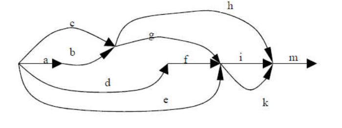

# Multithreading_posix

This program launches threads according to a pre-defined schedule (see the diagram below) and prints their names to the console. The threads are managed using POSIX thread (pthreads) standards.

## Features

- **Thread Management**: Threads are created and managed according to a specific schedule.
- **Console Output**: Each thread outputs its name to the console upon execution.
- **POSIX Compliance**: Thread operations are handled using POSIX threads (pthreads).

## Diagram

